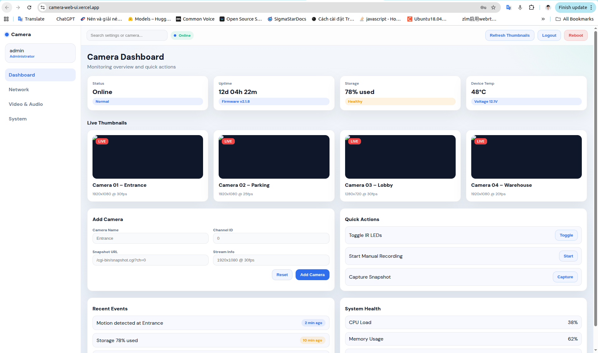
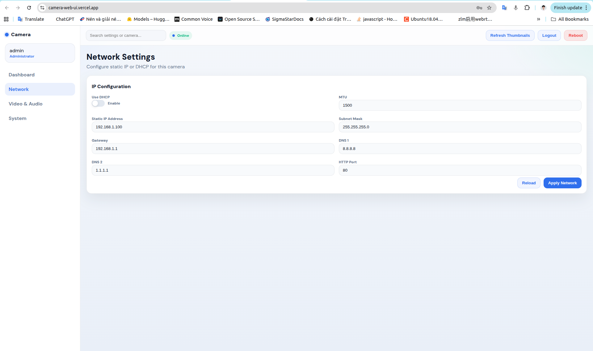
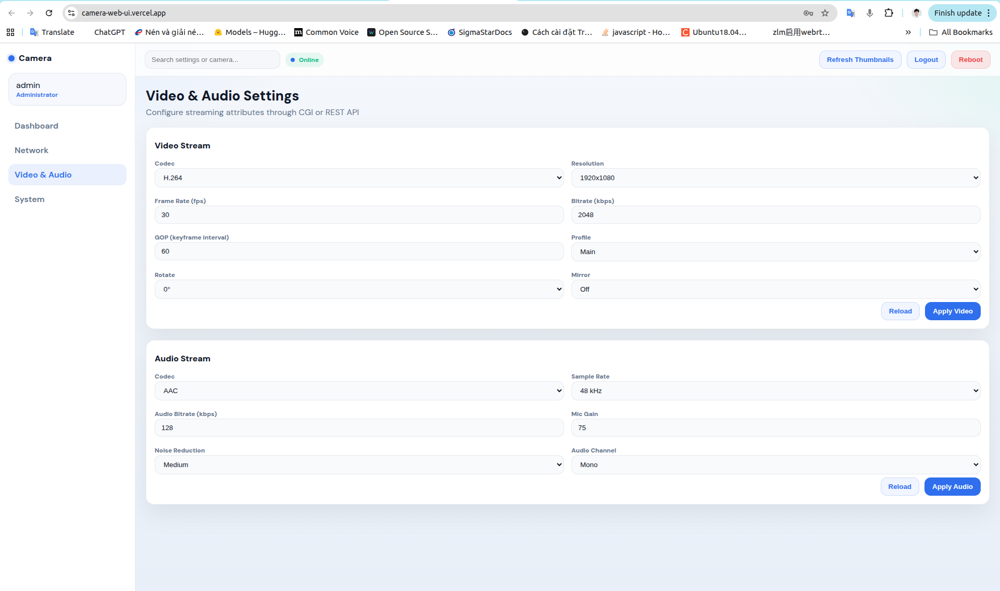
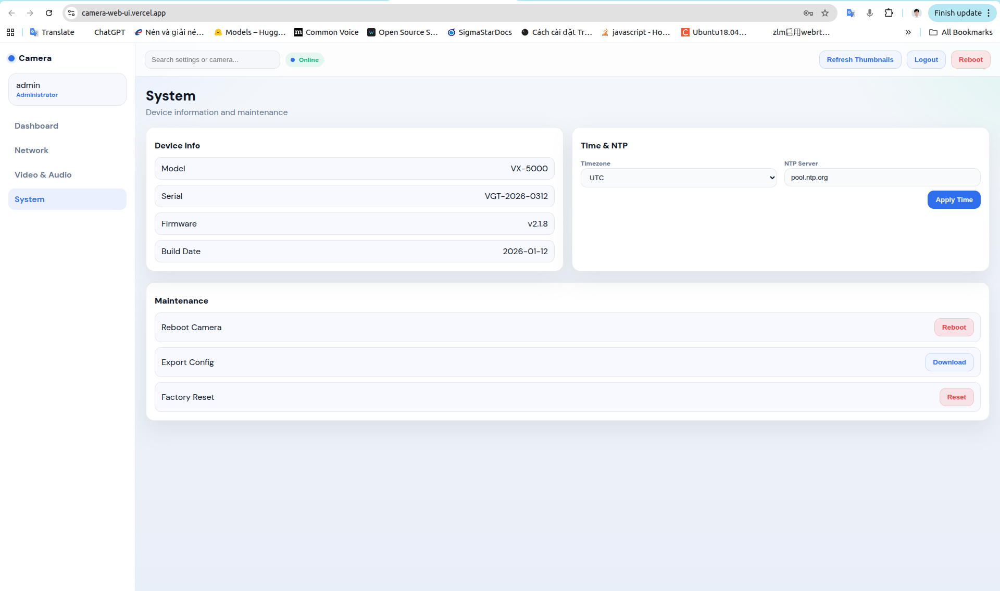

# Camera Web UI

A web UI for camera management with dashboard, video/audio settings, network, system, login/logout, and camera list management (add). This project is currently a static frontend with a mock mode for demo purposes.

## Key Features
- Dashboard: camera status, health, events, thumbnails.
- Video & Audio: codec, bitrate, fps, profile, audio options.
- Network: DHCP/Static IP, DNS, MTU, HTTP port.
- System: device info, time/NTP, reboot/export/reset.
- Login/Logout (mock) and add camera (localStorage).

## Structure
- `index.html` main UI
- `css/style.css` styling
- `js/app.js` logic + mock data
- `pages/` page contents

## Run Locally
Open `index.html` directly or use a simple web server:

```bash
python -m http.server 8080
```

Then visit `http://localhost:8080`.






## Mock vs Real API
In `js/app.js`:
- `USE_MOCK = true`: use mock data.
- `USE_MOCK = false`: call real API endpoints in `ENDPOINTS`.

Example endpoints to map:
- Login/Logout: `/cgi-bin/login.cgi`, `/cgi-bin/logout.cgi`
- Status: `/cgi-bin/status.cgi`
- Video/Audio/Network/Time: `/cgi-bin/*.cgi`

## Deploy to Vercel
- Push the code to GitHub/GitLab.
- Vercel → New Project → Import repo.
- Framework: **Other**
- Build Command: empty
- Output Directory: empty or `.`

After deployment, open the Vercel URL to view the UI.

> Note: Vercel only hosts the static frontend. Camera CGI/REST will not run on Vercel. Use a backend/proxy or call the camera IP directly (CORS permitting) if you need real control.

### WebRTC runtime variables
The dashboard reads WebRTC settings from `GET /api/runtime-config` when deployed on Vercel.

Set these Vercel environment variables if you want to override the defaults:

```bash
WEBRTC_SERVER_HOST=127.0.0.1
WEBRTC_WS_PORT=23000
WEBRTC_STUN_URL=stun:127.0.0.1:23001
WEBRTC_TURN_URL=turn:127.0.0.1:23001?transport=udp
WEBRTC_TURN_USERNAME=myuser
WEBRTC_TURN_CREDENTIAL=mypassword
WEBRTC_ICE_TRANSPORT_POLICY=relay
```

If `/api/runtime-config` is unavailable, the frontend falls back to the current defaults.

## Ideas to Extend
- Full CRUD for cameras (edit/delete).
- Real auth (token/cookie).
- API proxy (Node/Go) to avoid CORS.
